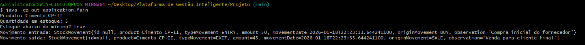

# Stock Control – Java (POO Focused Project)



Projeto Java focado em Programação Orientada a Objetos (POO), com modelagem de domínio para controle de estoque e regras de negócio explícitas.

Este projeto nasceu durante o bootcamp **Accenture Java & AWS (DIO)**, como uma forma prática de organizar o conhecimento adquirido e transformar teoria em código com regras de negócio reais.

---

## 🎯 Objetivo do Projeto

O principal objetivo deste projeto é:

* Consolidar conceitos de **POO em Java**
* Aplicar boas práticas de **modelagem de domínio**
* Trabalhar regras de negócio de forma clara e explícita
* Criar uma base sólida para evolução futura do sistema

A ideia não foi criar um sistema completo desde o início, mas sim **evoluir gradualmente**, entendendo quando e por que aplicar cada conceito.

---

## 🧠 Conceitos Aplicados

Neste projeto foram aplicados, na prática:

* Encapsulamento e validações de estado
* Abstração de regras de negócio no domínio
* Uso de `equals()` e `hashCode()`
* Enums para padronização de tipos e categorias
* Separação de responsabilidades (Domain vs Application)
* Tratamento de exceções para garantir integridade do sistema

Tudo foi pensado para simular decisões comuns em projetos reais.

---

## 🏗️ Estrutura do Projeto

```
src/
 ├── application
 │   └── Main.java
 └── domain
     ├── product
     │   └── Product.java
     └── stock
         ├── Stock.java
         ├── StockMovement.java
         └── StockService.java
```

### Descrição das camadas:

* **application**: ponto de entrada da aplicação e simulação de uso
* **domain**: contém toda a regra de negócio do sistema

  * Produto
  * Estoque
  * Movimentações de estoque

---

## 🔄 Exemplo de Fluxo Implementado

O fluxo atual da aplicação simula:

1. Criação de um produto
2. Definição de preço de custo e venda
3. Criação de um estoque com quantidade mínima
4. Registro de entrada de produtos (compra)
5. Registro de saída de produtos (venda)
6. Validação automática de saldo e estoque mínimo

Tudo isso é feito respeitando regras de negócio, evitando estados inválidos.

---

## 🛠️ Tecnologias Utilizadas

* Java 21 (LTS)
* Programação Orientada a Objetos (POO)
* Git e GitHub

*(Sem frameworks neste momento, foco total no domínio e na base do Java)*

---

## 🚀 Próximos Passos (Roadmap)

Este projeto foi pensado para evoluir gradualmente. Próximas etapas planejadas:

* Integração com banco de dados
* Uso de Spring Boot
* Criação de API REST
* Implementação de testes automatizados
* Aplicação de boas práticas como DTOs e camadas de serviço

---

## 👨‍💻 Sobre o Autor

Projeto desenvolvido por **Marcos Gabriel**, estudante de Java, com foco em construir uma base sólida para atuação profissional.

Este repositório representa não apenas um projeto, mas um **processo de aprendizado contínuo**.
